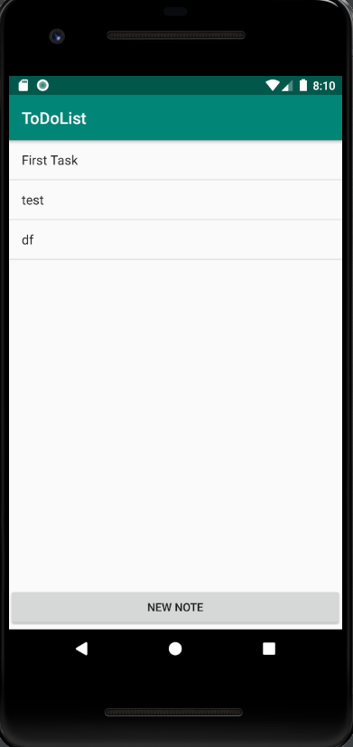
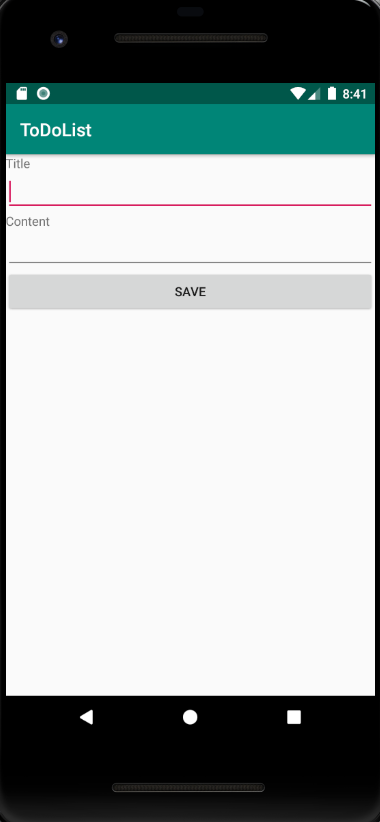
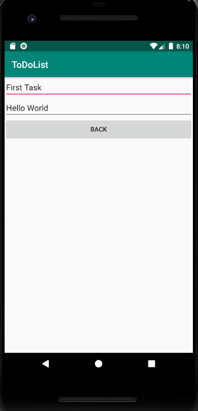
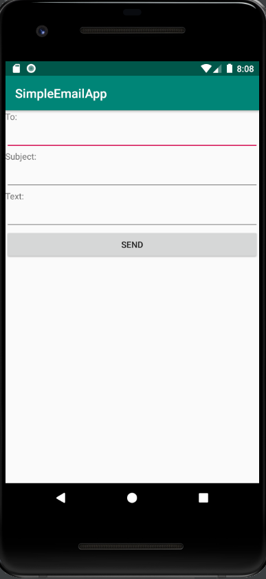
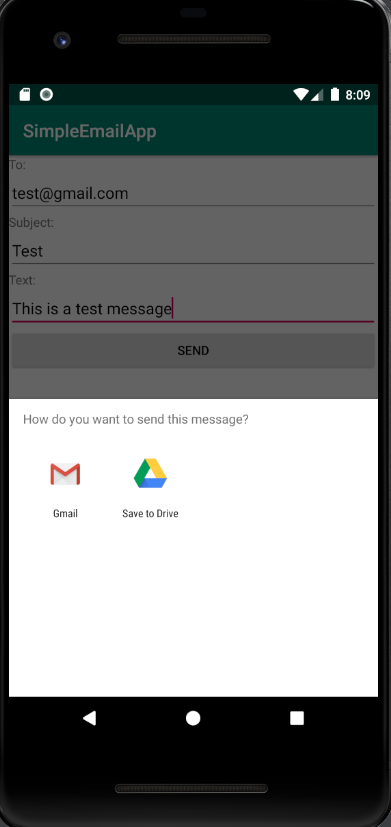

# Android-Mobile-App-Dev
Android Mobile Apps Created in class.
Just download the zip files for the application you want to your desktop, then unzip the file and open the folder in Android Studio.

# SimpleCaclculator App:
The SimpleCalculator App has the basic 4 math arithmetic operations add, subract, divide and multiply. You need to enter the two numbers first before you can perform the operators.

# ToDoList App:
This is a very simple ToDo list app I started and its not finished. The only functionalities added are creating a new note and saving it and then viewing that note after it is saved.

# SimpleEmailApp:
The SimpleEmailApp is a basic email sending app that using Intent Activity to launch Gmail app and send the email. For this to work you do need an email account setup on anyone of your email apps as it will ask you which app you would like to use to send the email.

